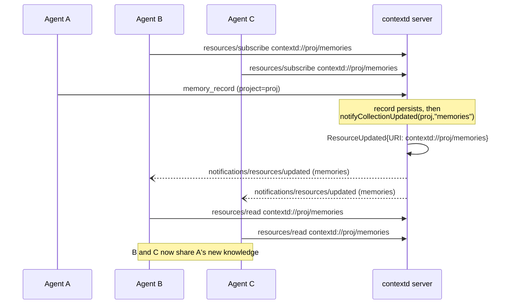

# Agent-Swarm Notifications

**Status:** Design (Phase D of MCP Protocol Expansion)
**Date:** 2026-06-19
**Spec area:** MCP protocol — resource subscriptions / notifications

## Problem

contextd now supports a **Streamable HTTP transport with stateful sessions**, so
multiple AI agents (each an MCP client) can connect to **one** contextd server
at the same time. We call this an *agent swarm*: the agents share the same
ReasoningBank memories, checkpoints, and remediations.

Sharing storage is not enough. When one agent records a new memory (or a
remediation, or a checkpoint), the other agents have no way to know fresh shared
knowledge exists — they keep working from a stale view until they happen to
search again. We want a **push**: when agent A records, agents B and C are told
the relevant collection changed so they can re-read it.

## Topology

```
        ┌─────────┐   ┌─────────┐   ┌─────────┐
        │ Agent A │   │ Agent B │   │ Agent C │   (MCP clients)
        └────┬────┘   └────┬────┘   └────┬────┘
             │             │             │
             └──── Streamable HTTP (stateful sessions) ────┐
                           │                               │
                    ┌──────▼───────────────────────────────▼─┐
                    │            ONE contextd server          │
                    │  shared memories / checkpoints / remed. │
                    └─────────────────────────────────────────┘
```

- **HTTP transport (stateful):** many clients, many sessions, one server. This
  is the only transport where swarm features apply.
- **stdio transport:** exactly one client per server process, so there is no
  swarm to coordinate — notifications are harmless no-ops there (no other
  sessions to notify).

## Mechanism

The swarm is built on three standard MCP pieces:

1. **Collection resources.** Each project exposes three collection URIs:
   - `contextd://{project_id}/memories`
   - `contextd://{project_id}/checkpoints`
   - `contextd://{project_id}/remediations`
2. **`resources/subscribe`.** An agent that cares about a collection subscribes
   to its URI. The go-sdk tracks subscriptions **per server session**
   automatically (`uri -> {session}` map inside the SDK `Server`).
3. **`ResourceUpdated` broadcast.** When any agent records, the corresponding
   record handler calls the helper:

   ```go
   func (s *Server) notifyCollectionUpdated(ctx context.Context, projectID, kind string)
   ```

   which builds `contextd://{project_id}/{kind}` and calls
   `s.mcp.ResourceUpdated(ctx, &mcp.ResourceUpdatedNotificationParams{URI: uri})`.
   The SDK fans `notifications/resources/updated` out to exactly the sessions
   subscribed to that URI.

Record-handler wiring (done by the integrator, not in `notifications.go`):

| Tool                 | kind            |
|----------------------|-----------------|
| `memory_record`      | `memories`      |
| `remediation_record` | `remediations`  |
| `checkpoint_save`    | `checkpoints`   |

### Sequence



## Why `resources/updated`, not `tools/list_changed`

The **data** behind a resource changed; the **set of tools** did not. The MCP
semantics map cleanly:

- `notifications/resources/updated` — "a resource you subscribed to changed; you
  may want to re-read it." Exactly our case.
- `notifications/tools/list_changed` — "the available tools changed." Irrelevant:
  recording a memory does not add or remove tools.

`resources/updated` is also **targeted** (only subscribers of that URI) and
**opt-in** (clients that never subscribe are never bothered), whereas
list-changed semantics are about the catalog, not the contents.

## Tenant isolation

The project_id is **embedded in the URI**. Subscriptions are keyed by URI, and
`ResourceUpdated` only reaches sessions subscribed to *that* URI. Therefore:

- `notifyCollectionUpdated(ctx, "tenant-A", "memories")` notifies only sessions
  subscribed to `contextd://tenant-A/memories`.
- An agent subscribed to `contextd://tenant-B/memories` receives **nothing** for
  tenant-A activity.

There is no cross-tenant leakage at the notification layer because the URI is
the routing key, and a different project_id is a different URI. (Reading the
resource itself remains fail-closed and tenant-scoped per the resources spec.)

## Self-notification

The agent that performed the record is *also* subscribed (typically) and will
receive the same `resources/updated` it caused. This is **harmless and
idempotent**:

- A re-read of a collection is cheap and returns a consistent snapshot.
- Clients may ignore updates they caused (e.g., correlate against a recent
  record), but they are not required to — re-reading is always safe.

We intentionally do **not** try to suppress self-notifications server-side: the
server does not (and should not) attribute a record to a particular subscribing
session, and the suppression logic would add state and edge cases for negligible
benefit.

## Failure modes

| Mode | Behaviour |
|------|-----------|
| **No subscribers** | `ResourceUpdated` fans out to an empty set — a no-op. |
| **Delivery best-effort** | `notifyCollectionUpdated` never returns an error to the record handler. A failed notification is logged (warn) and swallowed so it cannot fail the underlying record. |
| **Disconnected session** | The SDK drops/cleans up sessions on close; a transient send failure to one session does not block others and does not affect the record. |
| **nil server** | The helper guards `s == nil || s.mcp == nil` and returns immediately (no panic). Relevant for tests and partially-constructed servers. |
| **Notification storms** | A burst of records produces a burst of updates. Subscribers re-read on each. See *Future work* (debouncing/coalescing). |

## Limits & future work

- **`list_changed` for collections.** If whole collections are added/removed
  (new project, project deletion), `notifications/resources/list_changed` would
  complement per-collection `updated`. Out of scope here.
- **Debouncing / coalescing.** Under heavy write rates, coalesce multiple
  updates for the same URI within a short window into one notification to avoid
  storms and redundant re-reads.
- **Per-item subscriptions.** Today subscription is per collection URI. A
  finer-grained `contextd://{project}/memory/{id}` subscription could notify on
  a single item, at the cost of more subscription bookkeeping.
- **Ordering guarantees.** `resources/updated` carries no version/sequence; it
  is a "something changed, re-read" hint. Agents must treat a re-read as the
  source of truth rather than inferring ordering from notification arrival.
- **Scaling many sessions.** Fan-out is O(subscribers per URI). For very large
  swarms, consider batching, backpressure, or a pub/sub layer; the current
  in-process map is appropriate for the expected swarm sizes.

## Implementation reference

- Helper: `internal/mcp/notifications.go` — `(*Server).notifyCollectionUpdated`.
- Tests: `internal/mcp/notifications_test.go` — nil-safe / no-subscriber
  no-ops and an end-to-end subscribe → record → `updated` delivery over
  in-memory transports.
- SDK API (go-sdk v1.1.0): `(*mcp.Server).ResourceUpdated`,
  `mcp.ResourceUpdatedNotificationParams{URI}`,
  `(*mcp.ClientSession).Subscribe`, `mcp.ClientOptions.ResourceUpdatedHandler`.
  Note: the SDK only tracks subscriptions when the server is constructed with a
  `SubscribeHandler`/`UnsubscribeHandler` pair (`mcp.ServerOptions`); the
  production server must register these to enable the swarm mechanism.
```
