# Error Testing and Remediation Patterns

This document details the error testing phase and remediation patterns discovered.

---

## Error Testing Strategy

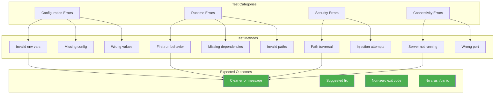

---

## Test Case 1: Invalid Vectorstore Provider

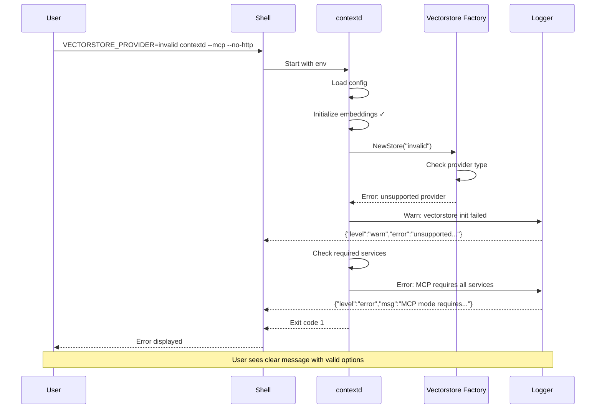

### Actual Output

```
{"level":"warn","ts":"...","caller":"contextd/main.go:229",
 "msg":"vectorstore initialization failed",
 "service":"contextd",
 "provider":"invalid",
 "error":"unsupported vectorstore provider: invalid (supported: chromem, qdrant)"}

{"level":"error","ts":"...","caller":"contextd/main.go:408",
 "msg":"MCP mode requires all services, but some are unavailable",
 "service":"contextd",
 "checkpoint":false,
 "remediation":false,
 "repository":false,
 "troubleshoot":false,
 "reasoningbank":false}

error: MCP mode requires all services to be available
```

### Quality Assessment

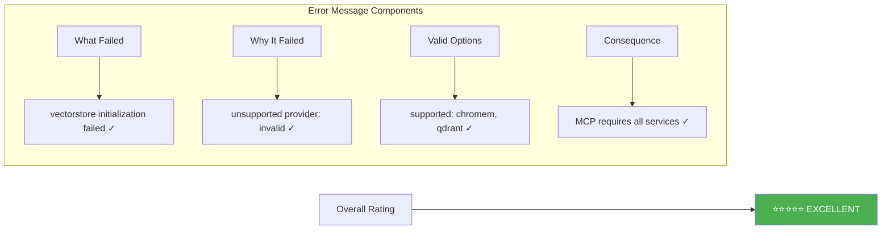

---

## Test Case 2: ctxd Health Without Server

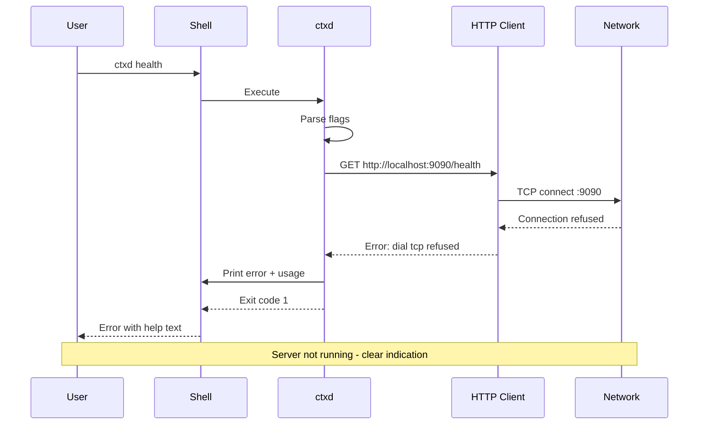

### Actual Output

```
Error: Failed to connect to http://localhost:9090/health:
       Get "http://localhost:9090/health": dial tcp [::1]:9090:
       connect: connection refused
Error: Get "http://localhost:9090/health": dial tcp [::1]:9090:
       connect: connection refused
Usage:
  ctxd health [flags]

Flags:
  -h, --help   help for health

Global Flags:
      --server string   contextd server URL (default "http://localhost:9090")
```

### Quality Assessment

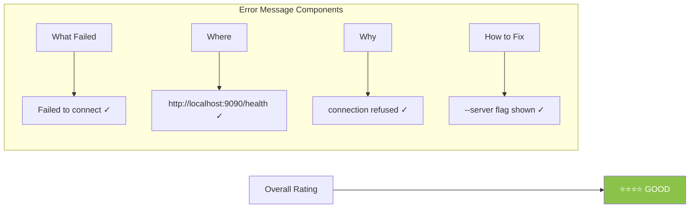

---

## Test Case 3: First Run Auto-Download

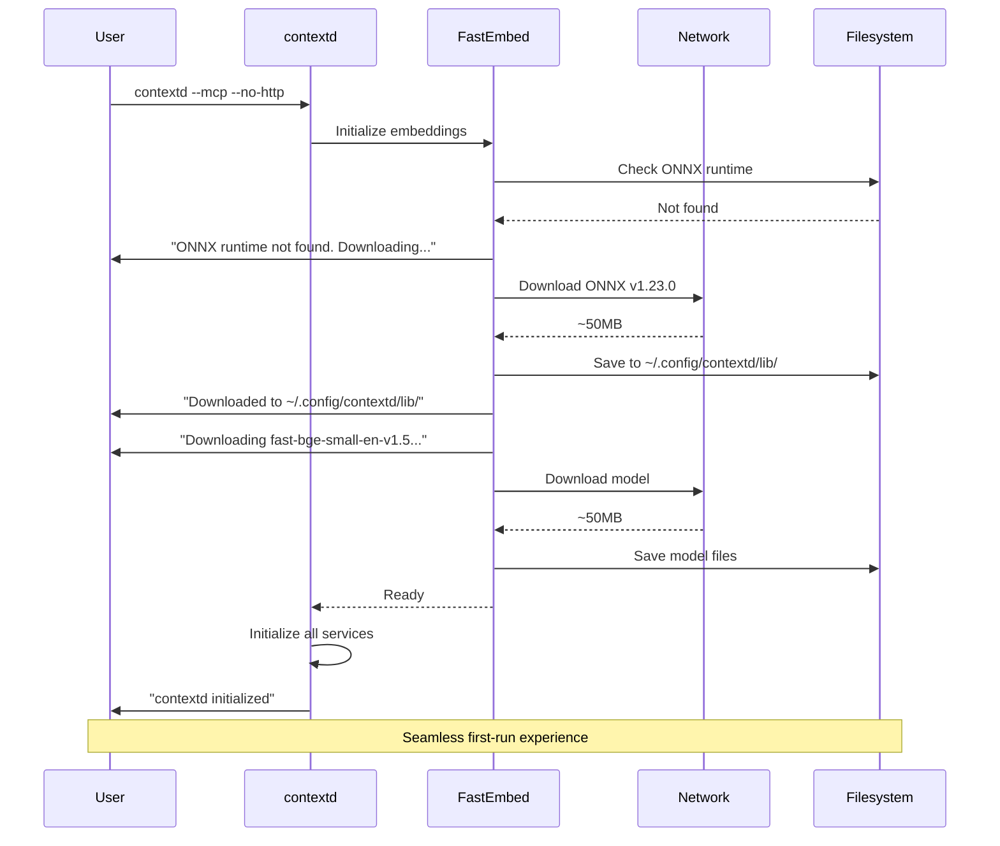

### Actual Output

```
{"level":"info","msg":"starting contextd",...}
{"level":"info","msg":"config loaded from default location"}
{"level":"info","msg":"telemetry initialized","enabled":false}
{"level":"info","msg":"secret scrubber initialized"}

ONNX runtime not found. Downloading v1.23.0 for linux/amd64...
Downloaded to /home/developer/.config/contextd/lib/libonnxruntime.so
Downloading fast-bge-small-en-v1.5...

{"level":"info","msg":"embeddings provider initialized",
 "model":"BAAI/bge-small-en-v1.5","dimension":384}
{"level":"info","msg":"ChromemStore initialized",
 "path":"/home/developer/.config/contextd/vectorstore"}
{"level":"info","msg":"contextd initialized",
 "services":["checkpoint:ok","remediation:ok","repository:ok",
             "troubleshoot:ok","reasoningbank:ok","folding:ok"]}
```

### Quality Assessment

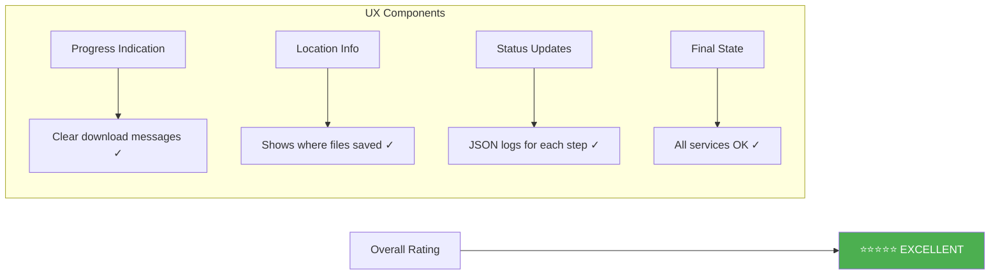

---

## Test Case 4: Path Traversal Attempt

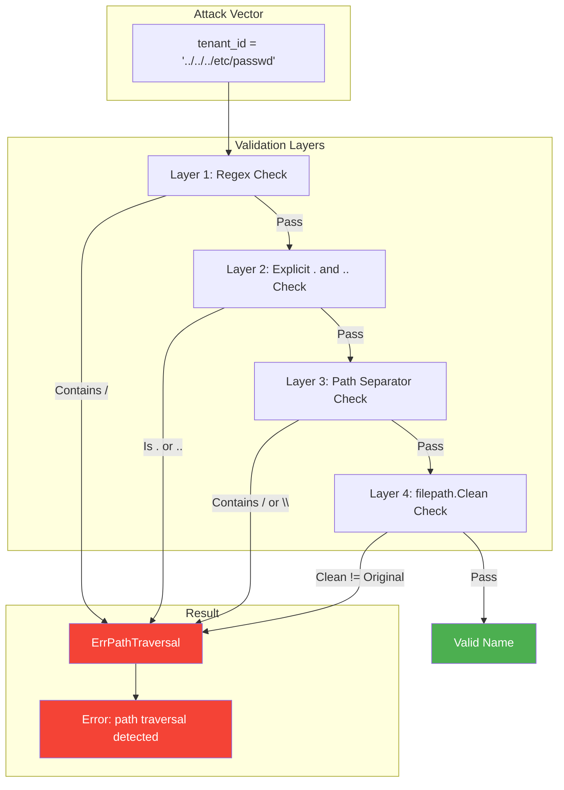

### Validation Code Flow

```mermaid
graph TD
    subgraph "ValidateName Function"
        A[Input: name] --> B{Empty?}
        B -->|Yes| ERR1[ErrInvalidName]
        B -->|No| C{Length > 255?}

        C -->|Yes| ERR2[ErrInvalidName: too long]
        C -->|No| D{Matches ^[a-zA-Z0-9][a-zA-Z0-9._-]*$}

        D -->|No| ERR3[ErrInvalidName]
        D -->|Yes| E{Is "." or ".."?}

        E -->|Yes| ERR4[ErrPathTraversal]
        E -->|No| F{Contains / \\ or \0?}

        F -->|Yes| ERR5[ErrPathTraversal]
        F -->|No| G{filepath.Clean(name) != name?}

        G -->|Yes| ERR6[ErrPathTraversal]
        G -->|No| OK[nil - Valid]
    end

    style ERR1 fill:#f44336,color:#fff
    style ERR2 fill:#f44336,color:#fff
    style ERR3 fill:#f44336,color:#fff
    style ERR4 fill:#f44336,color:#fff
    style ERR5 fill:#f44336,color:#fff
    style ERR6 fill:#f44336,color:#fff
    style OK fill:#4caf50,color:#fff
```

---

## Remediation Pattern Structure

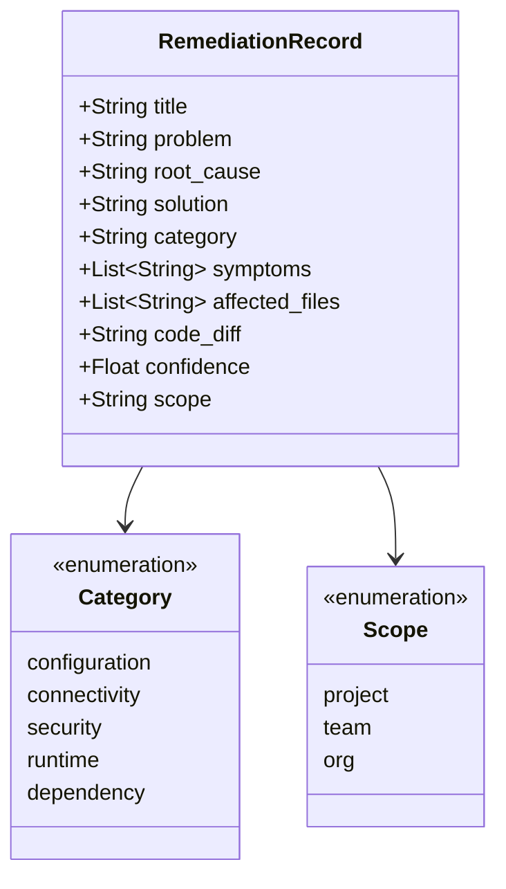

---

## Generated Remediation Patterns

### Pattern 1: Invalid Vectorstore Provider

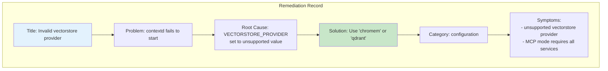

```yaml
title: "Invalid vectorstore provider configuration"
problem: "contextd fails to start with unsupported vectorstore provider"
root_cause: "VECTORSTORE_PROVIDER environment variable set to unsupported value"
solution: "Use 'chromem' (default, embedded) or 'qdrant' (external) as VECTORSTORE_PROVIDER"
category: "configuration"
symptoms:
  - "unsupported vectorstore provider"
  - "MCP mode requires all services"
  - "vectorstore initialization failed"
confidence: 0.95
scope: "org"
```

### Pattern 2: Connection Refused

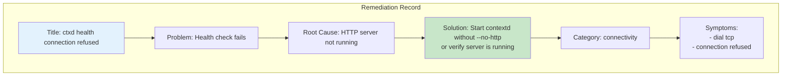

```yaml
title: "ctxd health check fails - connection refused"
problem: "ctxd health command fails with connection refused error"
root_cause: "contextd HTTP server not running (--no-http flag used or server not started)"
solution: "Start contextd without --no-http flag, or verify server is running on correct port"
category: "connectivity"
symptoms:
  - "dial tcp"
  - "connection refused"
  - "Failed to connect to http://localhost:9090"
confidence: 0.90
scope: "org"
```

### Pattern 3: Path Traversal Blocked

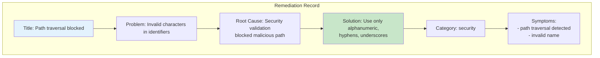

```yaml
title: "Path traversal blocked in tenant/project names"
problem: "Attempting to use path traversal characters in tenant_id or project_id"
root_cause: "Security validation blocked potentially malicious path components"
solution: "Use only alphanumeric characters, hyphens (-), underscores (_), and dots (.) in identifiers"
category: "security"
symptoms:
  - "path traversal detected"
  - "invalid name"
  - "ErrPathTraversal"
confidence: 0.99
scope: "org"
```

---

## Error Handling Quality Rubric

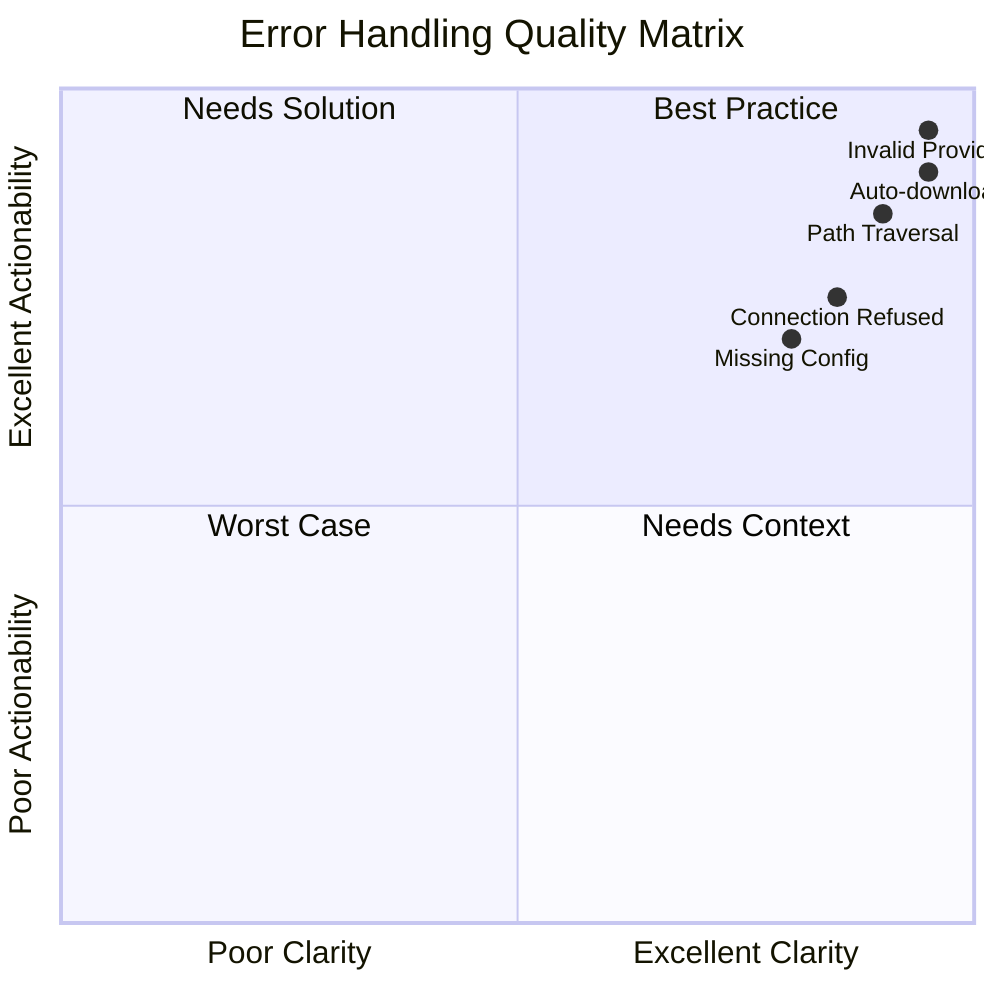

---

## Error Testing Summary

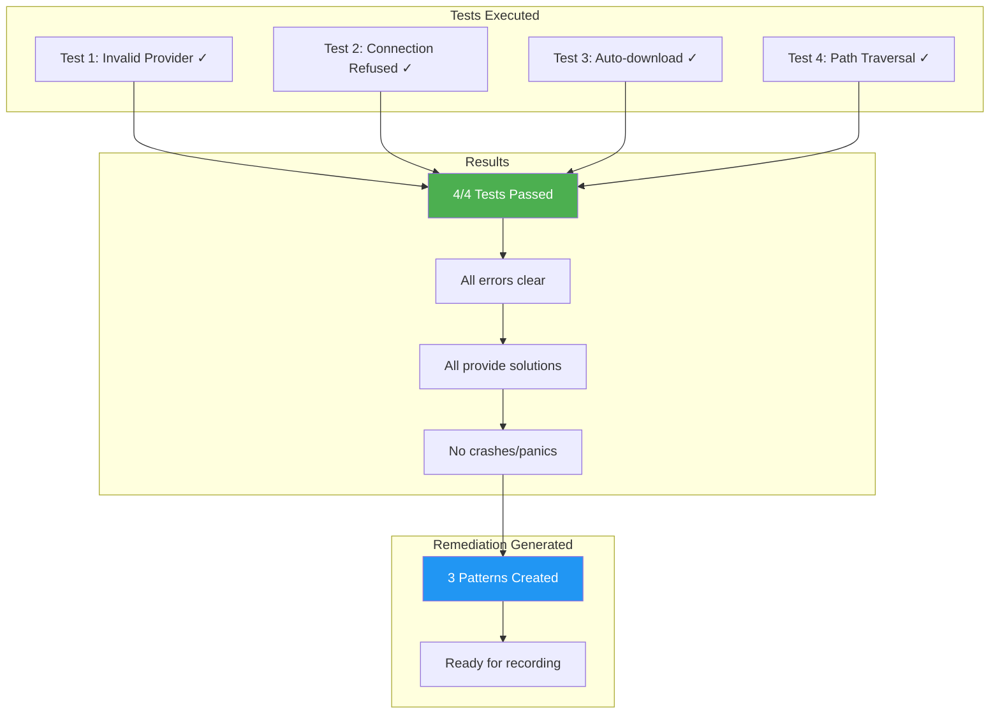
