# Issue Tracking and Resolution

This document details the issues found during persona simulation and their resolution.

---

## Issue Discovery Flow

---

## Issue Severity Classification

```mermaid
flowchart TD
    START[New Issue] --> Q1{Prevents Installation?}

    Q1 -->|Yes| Q2{Wrong Information?}
    Q1 -->|No| Q3{Causes User Confusion?}

    Q2 -->|Yes| CRITICAL[🔴 CRITICAL]
    Q2 -->|No| HIGH1[🟠 HIGH]

    Q3 -->|Yes| Q4{First-time User Affected?}
    Q3 -->|No| Q5{Nice to Have?}

    Q4 -->|Severely| HIGH2[🟠 HIGH]
    Q4 -->|Moderately| MEDIUM[🟡 MEDIUM]
    Q4 -->|Slightly| LOW1[🟢 LOW]

    Q5 -->|Yes| LOW2[🟢 LOW]
    Q5 -->|No| WONTFIX[⚪ WON'T FIX]

    style CRITICAL fill:#f44336,color:#fff
    style HIGH1 fill:#ff9800,color:#fff
    style HIGH2 fill:#ff9800,color:#fff
    style MEDIUM fill:#ffeb3b
    style LOW1 fill:#4caf50,color:#fff
    style LOW2 fill:#4caf50,color:#fff
```

---

## Round 1: All Issues Discovered

---

## Issue Resolution Matrix

---

## Issue-to-Section Mapping

---

## Per-Persona Issue Resolution

### Marcus (Backend Developer)

| Issue | Round 1 | Round 2 | Resolution |
|-------|---------|---------|------------|
| #1 Prerequisites | FOUND | RESOLVED | Prerequisites section added |
| #2 Claude Command | FOUND | RESOLVED | Explained in Prerequisites |
| #3 Homebrew Fallback | FOUND | RESOLVED | Troubleshooting section |
| #4 ONNX Dependency | FOUND | RESOLVED | Auto-downloads (tested) |
| #5 settings.json | FOUND | RESOLVED | Note about creation |
| #6 Verification | FOUND | RESOLVED | Verify Setup section |
| #7 Auto-download | FOUND | RESOLVED | First Run section |

### Sarah (Frontend Developer)

| Issue | Round 1 | Round 2 | Resolution |
|-------|---------|---------|------------|
| #9 Quick Start Verbose | FOUND | RESOLVED | Streamlined with "Easiest" label |
| #10 Troubleshooting | FOUND | RESOLVED | Troubleshooting section added |
| #11 Binary Location | FOUND | RESOLVED | Install path examples |
| #12 Config Location | FOUND | RESOLVED | Split CLI/Desktop sections |

### Alex (Full Stack Developer)

| Issue | Round 1 | Round 2 | Resolution |
|-------|---------|---------|------------|
| #14 Plugin Behavior | FOUND | RESOLVED | Clarified in Quick Start |
| #15 Multi-project | FOUND | RESOLVED | Project ID section |
| #16 Config Incomplete | FOUND | RESOLVED | Env vars documented |
| #17 Git Integration | FOUND | RESOLVED | Project ID section |
| #18 Health Check | FOUND | RESOLVED | /mcp command documented |

### Jordan (DevOps Engineer)

| Issue | Round 1 | Round 2 | Resolution |
|-------|---------|---------|------------|
| #19 Data Privacy | FOUND | RESOLVED | Privacy section added |
| #20 Docker Buried | FOUND | DEFERRED | Low priority |
| #21 Team Deployment | FOUND | DEFERRED | Future documentation |
| #22 Config Example | FOUND | PARTIAL | Env vars shown |
| #23 Backup Timing | FOUND | RESOLVED | Directory structure shown |
| #24 Secret Details | FOUND | PARTIAL | gitleaks mentioned |

---

## Resolution Timeline

---

## Remaining Issues Analysis

---

## Quality Metrics

---

## Lessons Learned

