# Persona Simulation Testing Methodology

This document describes the methodology used to test contextd documentation through persona-driven simulation.

---

## Overview

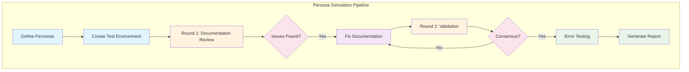
```mermaid
graph TB
    subgraph "Persona Simulation Pipeline"
        A[Define Personas] --> B[Create Test Environment]
        B --> C[Round 1: Documentation Review]
        C --> D{Issues Found?}
        D -->|Yes| E[Fix Documentation]
        E --> F[Round 2: Validation]
        F --> G{Consensus?}
        G -->|No| E
        G -->|Yes| H[Error Testing]
        H --> I[Generate Report]
    end

    style A fill:#e1f5fe
    style B fill:#e1f5fe
    style C fill:#fff3e0
    style D fill:#fce4ec
    style E fill:#f3e5f5
    style F fill:#fff3e0
    style G fill:#fce4ec
    style H fill:#e8f5e9
    style I fill:#e8f5e9
```

---

## Test Environment Architecture

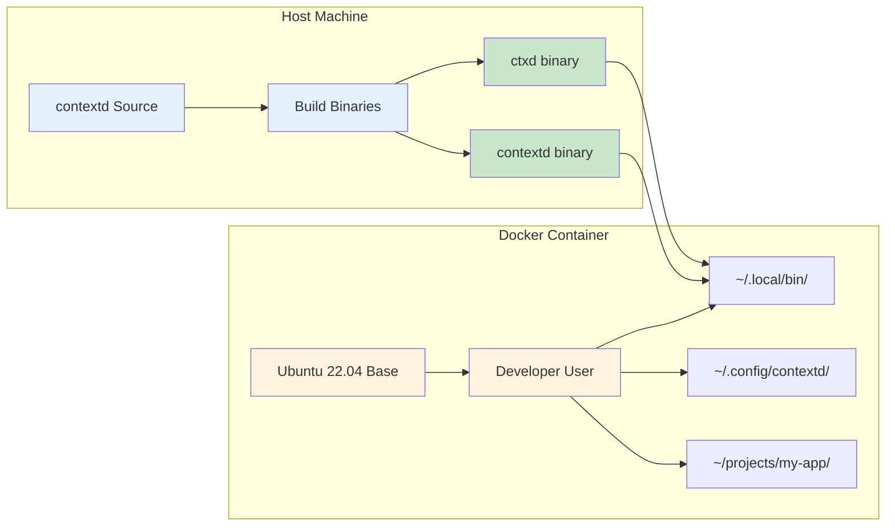
```mermaid
graph LR
    subgraph "Host Machine"
        A[contextd Source] --> B[Build Binaries]
        B --> C[contextd binary]
        B --> D[ctxd binary]
    end

    subgraph "Docker Container"
        E[Ubuntu 22.04 Base]
        F[Developer User]
        G[~/.local/bin/]
        H[~/.config/contextd/]
        I[~/projects/my-app/]

        E --> F
        F --> G
        F --> H
        F --> I
    end

    C --> G
    D --> G

    style A fill:#e3f2fd
    style B fill:#e3f2fd
    style C fill:#c8e6c9
    style D fill:#c8e6c9
    style E fill:#fff3e0
    style F fill:#fff3e0
```

### Container Specification

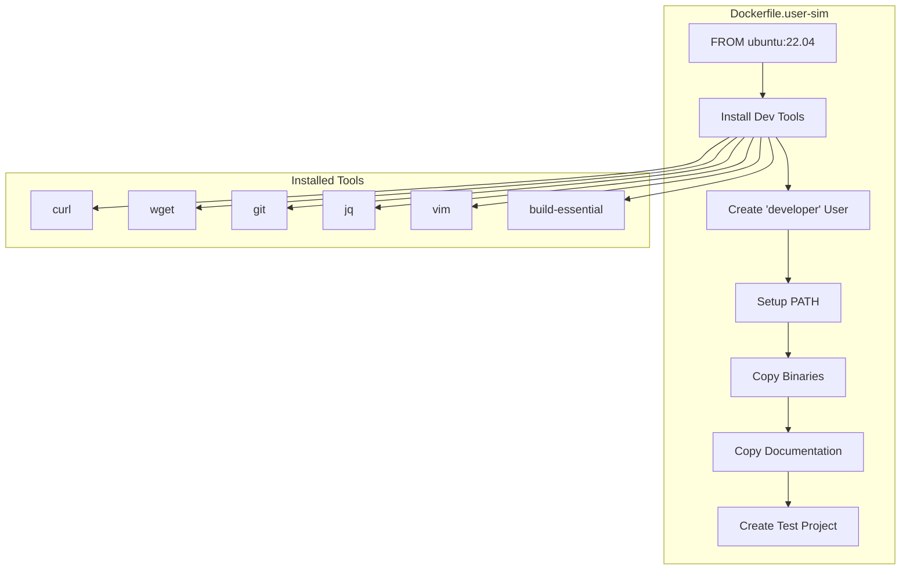
```mermaid
graph TD
    subgraph "Dockerfile.user-sim"
        A[FROM ubuntu:22.04] --> B[Install Dev Tools]
        B --> C[Create 'developer' User]
        C --> D[Setup PATH]
        D --> E[Copy Binaries]
        E --> F[Copy Documentation]
        F --> G[Create Test Project]
    end

    subgraph "Installed Tools"
        B --> B1[curl]
        B --> B2[wget]
        B --> B3[git]
        B --> B4[jq]
        B --> B5[vim]
        B --> B6[build-essential]
    end
```

---

## Persona Definition Structure

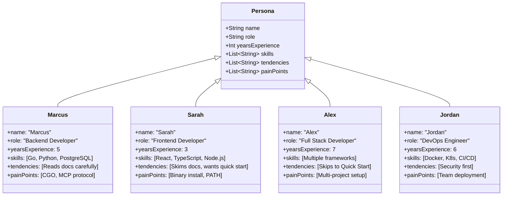
```mermaid
classDiagram
    class Persona {
        +String name
        +String role
        +Int yearsExperience
        +List~String~ skills
        +List~String~ tendencies
        +List~String~ painPoints
    }

    class Marcus {
        +name: "Marcus"
        +role: "Backend Developer"
        +yearsExperience: 5
        +skills: [Go, Python, PostgreSQL]
        +tendencies: [Reads docs carefully]
        +painPoints: [CGO, MCP protocol]
    }

    class Sarah {
        +name: "Sarah"
        +role: "Frontend Developer"
        +yearsExperience: 3
        +skills: [React, TypeScript, Node.js]
        +tendencies: [Skims docs, wants quick start]
        +painPoints: [Binary install, PATH]
    }

    class Alex {
        +name: "Alex"
        +role: "Full Stack Developer"
        +yearsExperience: 7
        +skills: [Multiple frameworks]
        +tendencies: [Skips to Quick Start]
        +painPoints: [Multi-project setup]
    }

    class Jordan {
        +name: "Jordan"
        +role: "DevOps Engineer"
        +yearsExperience: 6
        +skills: [Docker, K8s, CI/CD]
        +tendencies: [Security first]
        +painPoints: [Team deployment]
    }

    Persona <|-- Marcus
    Persona <|-- Sarah
    Persona <|-- Alex
    Persona <|-- Jordan
```

---

## Round 1: Documentation Review Process

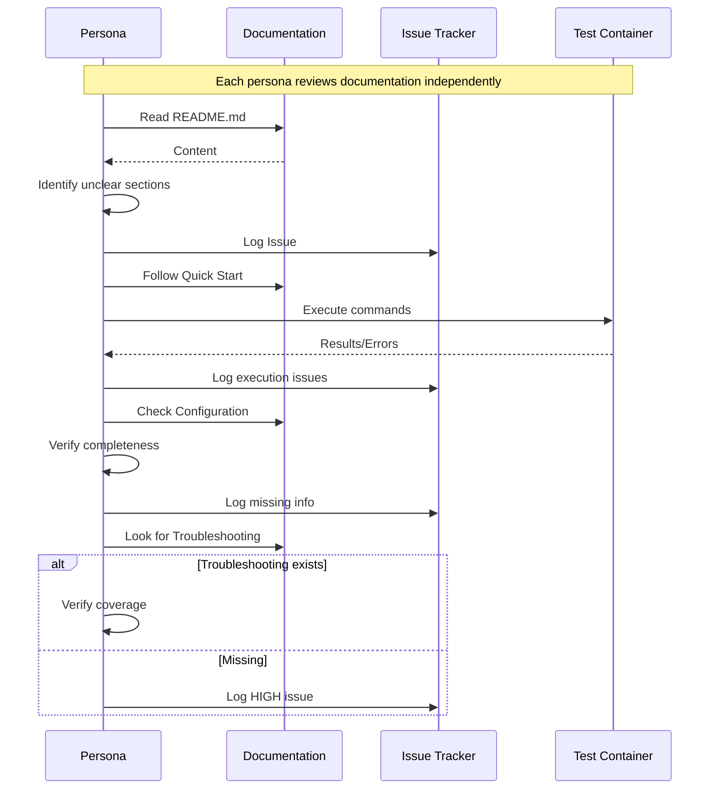
```mermaid
sequenceDiagram
    participant P as Persona
    participant D as Documentation
    participant I as Issue Tracker
    participant T as Test Container

    Note over P,T: Each persona reviews documentation independently

    P->>D: Read README.md
    D-->>P: Content
    P->>P: Identify unclear sections
    P->>I: Log Issue #1-N

    P->>D: Follow Quick Start
    P->>T: Execute commands
    T-->>P: Results/Errors
    P->>I: Log execution issues

    P->>D: Check Configuration
    P->>P: Verify completeness
    P->>I: Log missing info

    P->>D: Look for Troubleshooting
    alt Troubleshooting exists
        P->>P: Verify coverage
    else Missing
        P->>I: Log HIGH issue
    end
```

### Issue Classification Flow

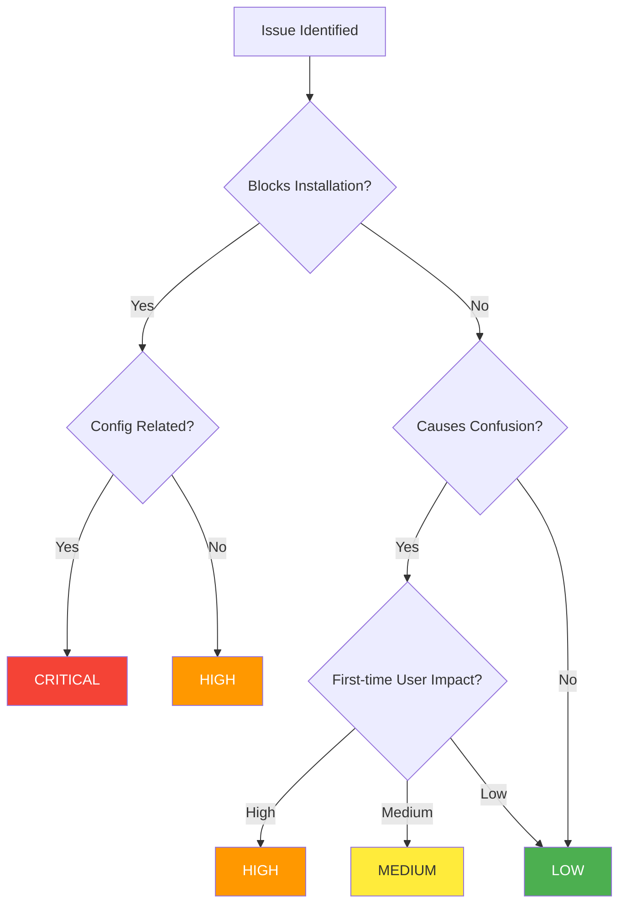
```mermaid
flowchart TD
    A[Issue Identified] --> B{Blocks Installation?}
    B -->|Yes| C{Config Related?}
    B -->|No| D{Causes Confusion?}

    C -->|Yes| E[CRITICAL]
    C -->|No| F[HIGH]

    D -->|Yes| G{First-time User Impact?}
    D -->|No| H[LOW]

    G -->|High| I[HIGH]
    G -->|Medium| J[MEDIUM]
    G -->|Low| H

    style E fill:#f44336,color:#fff
    style F fill:#ff9800,color:#fff
    style I fill:#ff9800,color:#fff
    style J fill:#ffeb3b
    style H fill:#4caf50,color:#fff
```

---

## Issue Categories Discovered

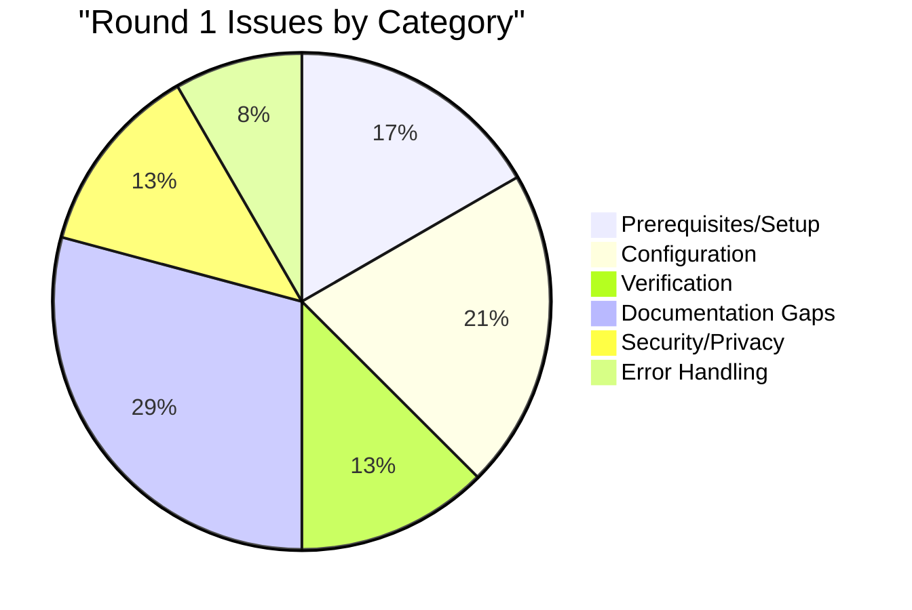
```mermaid
pie title "Round 1 Issues by Category"
    "Prerequisites/Setup" : 4
    "Configuration" : 5
    "Verification" : 3
    "Documentation Gaps" : 7
    "Security/Privacy" : 3
    "Error Handling" : 2
```

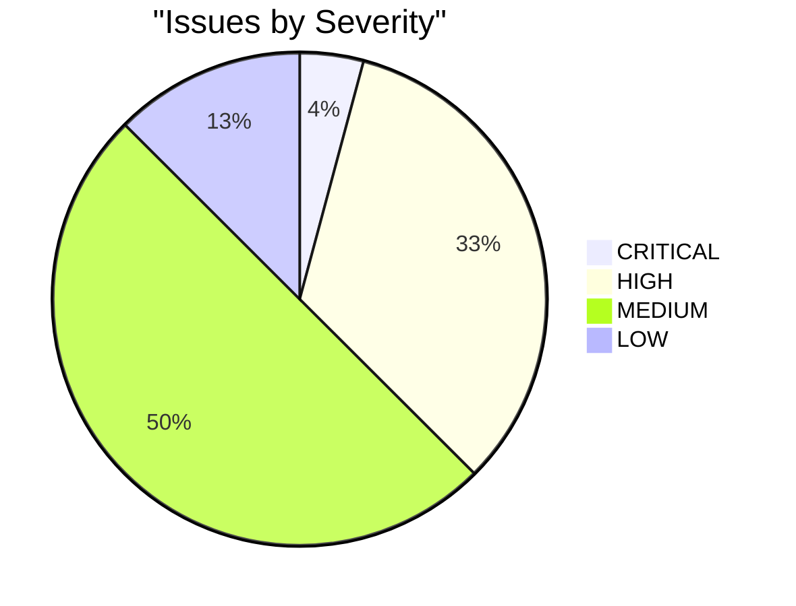
```mermaid
pie title "Issues by Severity"
    "CRITICAL" : 1
    "HIGH" : 8
    "MEDIUM" : 12
    "LOW" : 3
```

---

## Documentation Fix Process

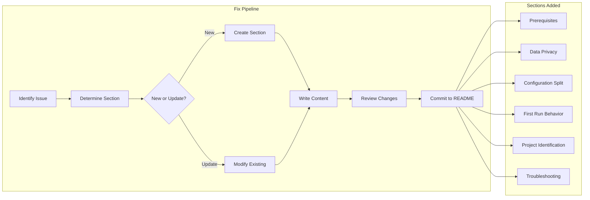
```mermaid
flowchart LR
    subgraph "Fix Pipeline"
        A[Identify Issue] --> B[Determine Section]
        B --> C{New or Update?}
        C -->|New| D[Create Section]
        C -->|Update| E[Modify Existing]
        D --> F[Write Content]
        E --> F
        F --> G[Review Changes]
        G --> H[Commit to README]
    end

    subgraph "Sections Added"
        I[Prerequisites]
        J[Data Privacy]
        K[Configuration Split]
        L[First Run Behavior]
        M[Project Identification]
        N[Troubleshooting]
    end

    H --> I
    H --> J
    H --> K
    H --> L
    H --> M
    H --> N
```

### README.md Structure Changes

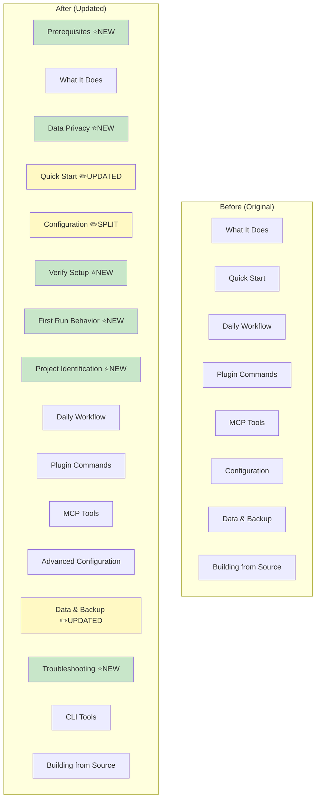
```mermaid
graph TD
    subgraph "Before (Original)"
        A1[What It Does]
        A2[Quick Start]
        A3[Daily Workflow]
        A4[Plugin Commands]
        A5[MCP Tools]
        A6[Configuration]
        A7[Data & Backup]
        A8[Building from Source]
    end

    subgraph "After (Updated)"
        B1[Prerequisites ⭐NEW]
        B2[What It Does]
        B3[Data Privacy ⭐NEW]
        B4[Quick Start ✏️UPDATED]
        B5[Configuration ✏️SPLIT]
        B6[Verify Setup ⭐NEW]
        B7[First Run Behavior ⭐NEW]
        B8[Project Identification ⭐NEW]
        B9[Daily Workflow]
        B10[Plugin Commands]
        B11[MCP Tools]
        B12[Advanced Configuration]
        B13[Data & Backup ✏️UPDATED]
        B14[Troubleshooting ⭐NEW]
        B15[CLI Tools]
        B16[Building from Source]
    end

    style B1 fill:#c8e6c9
    style B3 fill:#c8e6c9
    style B4 fill:#fff9c4
    style B5 fill:#fff9c4
    style B6 fill:#c8e6c9
    style B7 fill:#c8e6c9
    style B8 fill:#c8e6c9
    style B13 fill:#fff9c4
    style B14 fill:#c8e6c9
```

---

## Round 2: Validation Process

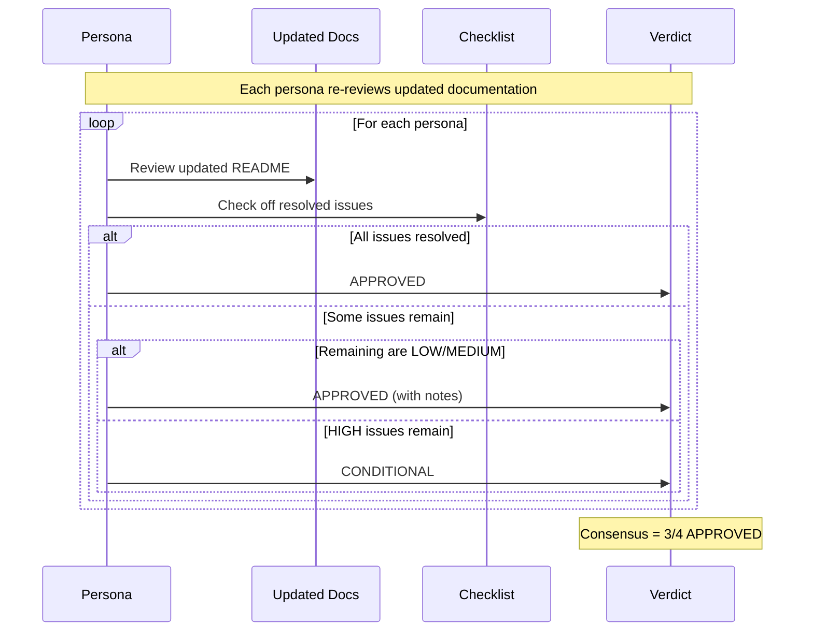
```mermaid
sequenceDiagram
    participant P as Persona
    participant D as Updated Docs
    participant C as Checklist
    participant V as Verdict

    Note over P,V: Each persona re-reviews updated documentation

    loop For each persona
        P->>D: Review updated README
        P->>C: Check off resolved issues

        alt All issues resolved
            P->>V: APPROVED
        else Some issues remain
            alt Remaining are LOW/MEDIUM
                P->>V: APPROVED (with notes)
            else HIGH issues remain
                P->>V: CONDITIONAL
            end
        end
    end

    Note over V: Consensus = 3/4 APPROVED
```

### Validation Results Matrix

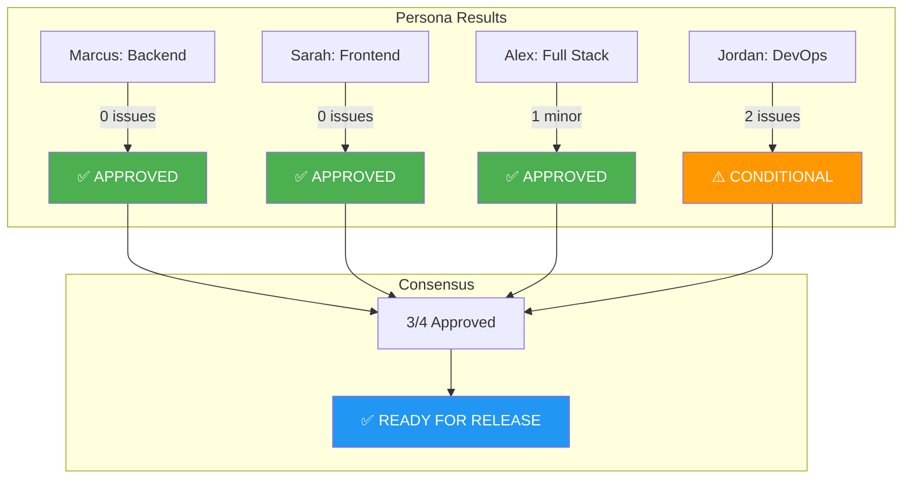
```mermaid
graph TD
    subgraph "Persona Results"
        M[Marcus: Backend] -->|0 issues| MA[✅ APPROVED]
        S[Sarah: Frontend] -->|0 issues| SA[✅ APPROVED]
        A[Alex: Full Stack] -->|1 minor| AA[✅ APPROVED]
        J[Jordan: DevOps] -->|2 issues| JA[⚠️ CONDITIONAL]
    end

    subgraph "Consensus"
        MA --> C[3/4 Approved]
        SA --> C
        AA --> C
        JA --> C
        C --> R[✅ READY FOR RELEASE]
    end

    style MA fill:#4caf50,color:#fff
    style SA fill:#4caf50,color:#fff
    style AA fill:#4caf50,color:#fff
    style JA fill:#ff9800,color:#fff
    style R fill:#2196f3,color:#fff
```

---

## Error Testing Phase

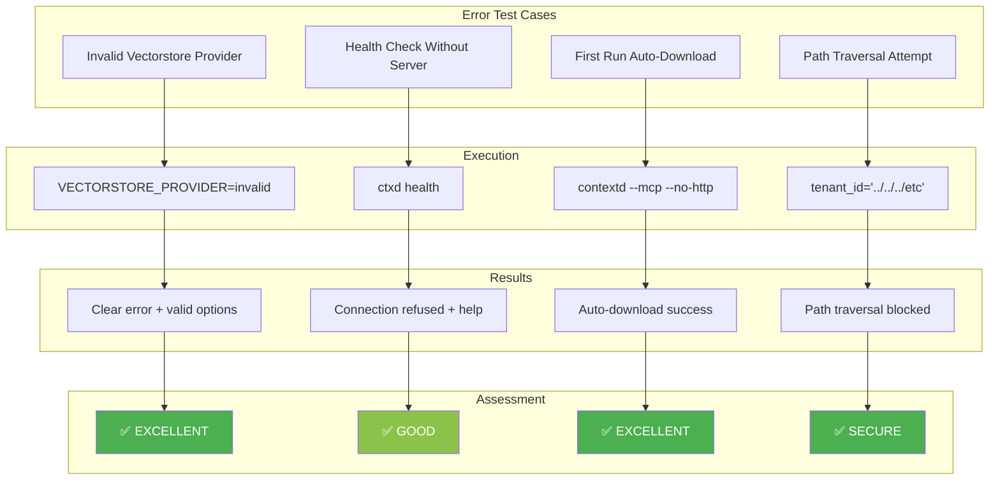
```mermaid
flowchart TD
    subgraph "Error Test Cases"
        T1[Invalid Vectorstore Provider]
        T2[Health Check Without Server]
        T3[First Run Auto-Download]
        T4[Path Traversal Attempt]
    end

    subgraph "Execution"
        T1 --> E1[VECTORSTORE_PROVIDER=invalid]
        T2 --> E2[ctxd health]
        T3 --> E3[contextd --mcp --no-http]
        T4 --> E4[tenant_id='../../../etc']
    end

    subgraph "Results"
        E1 --> R1[Clear error + valid options]
        E2 --> R2[Connection refused + help]
        E3 --> R3[Auto-download success]
        E4 --> R4[Path traversal blocked]
    end

    subgraph "Assessment"
        R1 --> A1[✅ EXCELLENT]
        R2 --> A2[✅ GOOD]
        R3 --> A3[✅ EXCELLENT]
        R4 --> A4[✅ SECURE]
    end

    style A1 fill:#4caf50,color:#fff
    style A2 fill:#8bc34a,color:#fff
    style A3 fill:#4caf50,color:#fff
    style A4 fill:#4caf50,color:#fff
```

### Error Message Quality Assessment

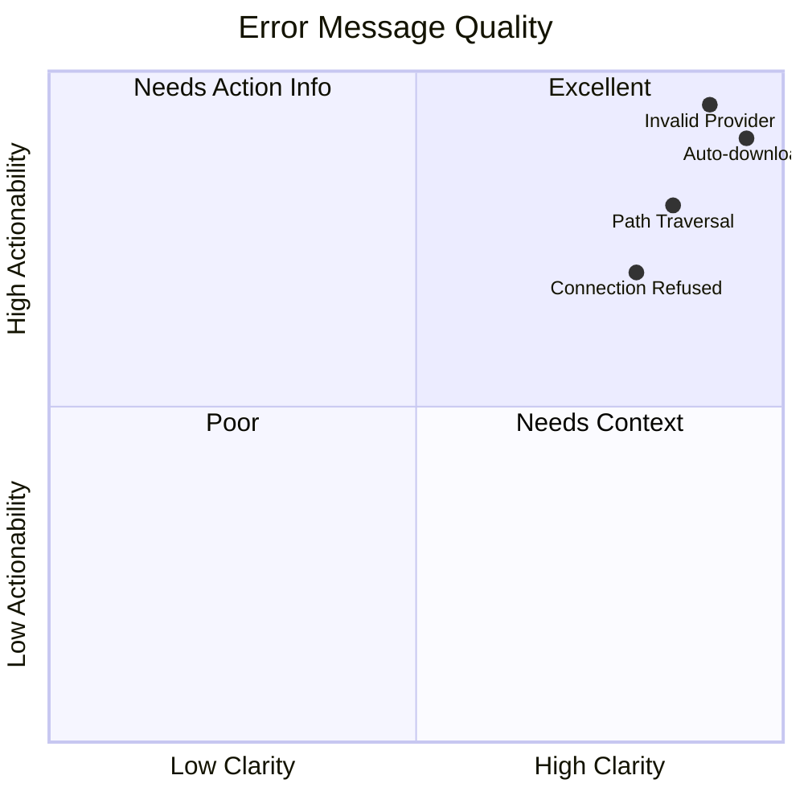
```mermaid
quadrantChart
    title Error Message Quality
    x-axis Low Clarity --> High Clarity
    y-axis Low Actionability --> High Actionability
    quadrant-1 Excellent
    quadrant-2 Needs Action Info
    quadrant-3 Poor
    quadrant-4 Needs Context

    "Invalid Provider": [0.9, 0.95]
    "Connection Refused": [0.8, 0.7]
    "Path Traversal": [0.85, 0.8]
    "Auto-download": [0.95, 0.9]
```

---

## Remediation Pattern Generation

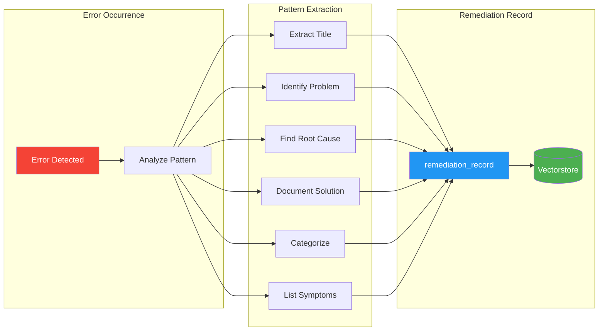
```mermaid
flowchart LR
    subgraph "Error Occurrence"
        E[Error Detected] --> A[Analyze Pattern]
    end

    subgraph "Pattern Extraction"
        A --> T[Extract Title]
        A --> P[Identify Problem]
        A --> R[Find Root Cause]
        A --> S[Document Solution]
        A --> C[Categorize]
        A --> Y[List Symptoms]
    end

    subgraph "Remediation Record"
        T --> RR[remediation_record]
        P --> RR
        R --> RR
        S --> RR
        C --> RR
        Y --> RR
        RR --> DB[(Vectorstore)]
    end

    style E fill:#f44336,color:#fff
    style RR fill:#2196f3,color:#fff
    style DB fill:#4caf50,color:#fff
```

---

## Overall Test Flow

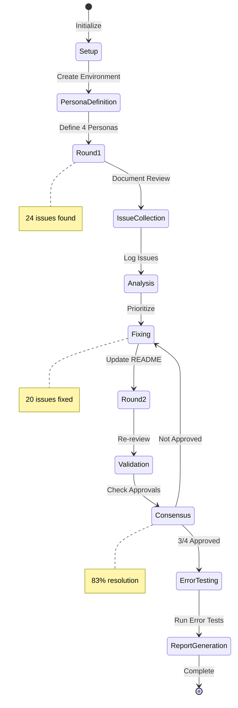
```mermaid
stateDiagram-v2
    [*] --> Setup: Initialize

    Setup --> PersonaDefinition: Create Environment
    PersonaDefinition --> Round1: Define 4 Personas

    Round1 --> IssueCollection: Document Review
    IssueCollection --> Analysis: Log Issues

    Analysis --> Fixing: Prioritize
    Fixing --> Round2: Update README

    Round2 --> Validation: Re-review
    Validation --> Consensus: Check Approvals

    Consensus --> ErrorTesting: 3/4 Approved
    Consensus --> Fixing: Not Approved

    ErrorTesting --> ReportGeneration: Run Error Tests
    ReportGeneration --> [*]: Complete

    note right of Round1: 24 issues found
    note right of Fixing: 20 issues fixed
    note right of Consensus: 83% resolution
```

---

## Metrics Dashboard

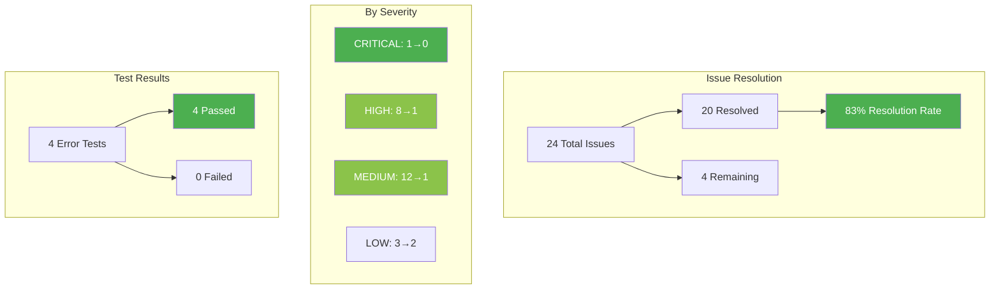
```mermaid
graph TD
    subgraph "Issue Resolution"
        A[24 Total Issues]
        A --> B[20 Resolved]
        A --> C[4 Remaining]
        B --> B1[83% Resolution Rate]
    end

    subgraph "By Severity"
        D[CRITICAL: 1→0]
        E[HIGH: 8→1]
        F[MEDIUM: 12→1]
        G[LOW: 3→2]
    end

    subgraph "Test Results"
        H[4 Error Tests]
        H --> H1[4 Passed]
        H --> H2[0 Failed]
    end

    style B1 fill:#4caf50,color:#fff
    style D fill:#4caf50,color:#fff
    style E fill:#8bc34a,color:#fff
    style F fill:#8bc34a,color:#fff
    style H1 fill:#4caf50,color:#fff
```

---

## Timeline

```mermaid
gantt
    title Persona Simulation Timeline
    dateFormat HH:mm
    axisFormat %H:%M

    section Setup
    Build Docker Image     :a1, 16:57, 5m
    Define Personas        :a2, after a1, 3m

    section Round 1
    Marcus Review          :b1, after a2, 8m
    Sarah Review           :b2, after b1, 5m
    Alex Review            :b3, after b2, 5m
    Jordan Review          :b4, after b3, 6m

    section Fixes
    Update README.md       :c1, after b4, 15m

    section Round 2
    All Personas Validate  :d1, after c1, 8m

    section Error Testing
    Run Error Tests        :e1, after d1, 5m
    Generate Report        :e2, after e1, 5m
```

---

## Files Generated

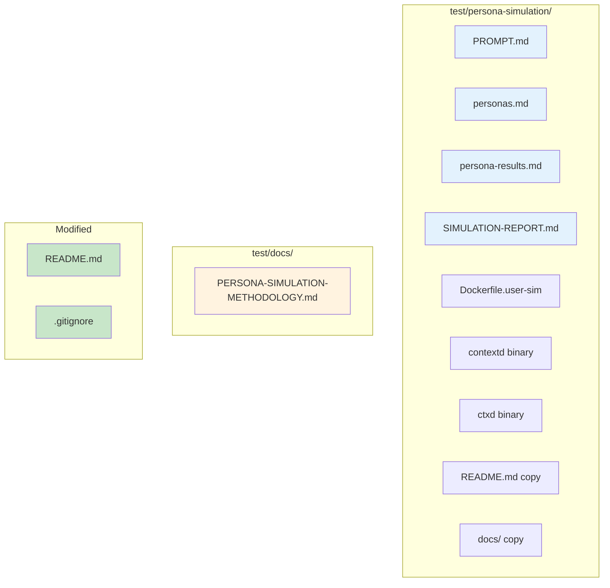
```mermaid
graph TD
    subgraph "test/persona-simulation/"
        A[PROMPT.md]
        B[personas.md]
        C[persona-results.md]
        D[SIMULATION-REPORT.md]
        E[Dockerfile.user-sim]
        F[contextd binary]
        G[ctxd binary]
        H[README.md copy]
        I[docs/ copy]
    end

    subgraph "test/docs/"
        J[PERSONA-SIMULATION-METHODOLOGY.md]
    end

    subgraph "Modified"
        K[README.md]
        L[.gitignore]
    end

    style A fill:#e3f2fd
    style B fill:#e3f2fd
    style C fill:#e3f2fd
    style D fill:#e3f2fd
    style J fill:#fff3e0
    style K fill:#c8e6c9
    style L fill:#c8e6c9
```

---

## Conclusion

This persona simulation methodology provides a structured approach to documentation testing by:

1. **Simulating real users** with different backgrounds and expectations
2. **Iterating until consensus** ensures broad appeal
3. **Testing actual functionality** catches runtime issues
4. **Generating remediation patterns** builds institutional knowledge

The methodology can be reused for future documentation updates by re-running the persona simulations with the updated content.
