# Test Documentation

This directory contains documentation for contextd testing methodologies and results.

---

## Contents

| Document | Description |
|----------|-------------|
| [PERSONA-SIMULATION-METHODOLOGY.md](PERSONA-SIMULATION-METHODOLOGY.md) | Complete methodology with flow diagrams |
| [TEST-ENVIRONMENT.md](TEST-ENVIRONMENT.md) | Docker container architecture |
| [ISSUE-TRACKING.md](ISSUE-TRACKING.md) | Issue discovery and resolution tracking |
| [ERROR-TESTING.md](ERROR-TESTING.md) | Error handling verification and remediation patterns |

---

## Quick Reference

### Test Pipeline Overview


### Key Metrics


### Persona Verdicts

| Persona | Role | Verdict |
|---------|------|---------|
| Marcus | Backend Dev | APPROVED |
| Sarah | Frontend Dev | APPROVED |
| Alex | Full Stack | APPROVED |
| Jordan | DevOps | CONDITIONAL |

---

## How to Use This Documentation

### For Reviewers

1. Start with [PERSONA-SIMULATION-METHODOLOGY.md](PERSONA-SIMULATION-METHODOLOGY.md) for overview
2. Review [ISSUE-TRACKING.md](ISSUE-TRACKING.md) for specific issues found
3. Check [ERROR-TESTING.md](ERROR-TESTING.md) for error handling quality

### For Rerunning Tests

1. Read [TEST-ENVIRONMENT.md](TEST-ENVIRONMENT.md) for setup instructions
2. Follow methodology in [PERSONA-SIMULATION-METHODOLOGY.md](PERSONA-SIMULATION-METHODOLOGY.md)
3. Record results in similar format

### For Future Improvements

1. Review remaining issues in [ISSUE-TRACKING.md](ISSUE-TRACKING.md)
2. Add new remediation patterns from [ERROR-TESTING.md](ERROR-TESTING.md)
3. Update persona definitions as user base evolves

---

## Related Files

### Test Artifacts (gitignored)

```
test/persona-simulation/
├── PROMPT.md              # Original test prompt
├── personas.md            # Persona definitions
├── persona-results.md     # Detailed test log
├── SIMULATION-REPORT.md   # Executive summary
├── Dockerfile.user-sim    # Test container
├── contextd               # Test binary
├── ctxd                   # Test CLI binary
├── README.md              # Documentation copy
└── docs/                  # Documentation copy
```

### Modified Files

- `README.md` - Major updates based on findings
- `.gitignore` - Added test/persona-simulation/

---

## Diagram Legend

### Severity Colors

```mermaid
graph LR
    C[CRITICAL] --> C1["🔴 #f44336"]
    H[HIGH] --> H1["🟠 #ff9800"]
    M[MEDIUM] --> M1["🟡 #ffeb3b"]
    L[LOW] --> L1["🟢 #4caf50"]

    style C fill:#f44336,color:#fff
    style H fill:#ff9800,color:#fff
    style M fill:#ffeb3b
    style L fill:#4caf50,color:#fff
```



### Status Colors

```mermaid
graph LR
    P[PASS] --> P1["✅ #4caf50"]
    F[FAIL] --> F1["❌ #f44336"]
    W[WARN] --> W1["⚠️ #ff9800"]
    I[INFO] --> I1["ℹ️ #2196f3"]

    style P fill:#4caf50,color:#fff
    style F fill:#f44336,color:#fff
    style W fill:#ff9800,color:#fff
    style I fill:#2196f3,color:#fff
```


