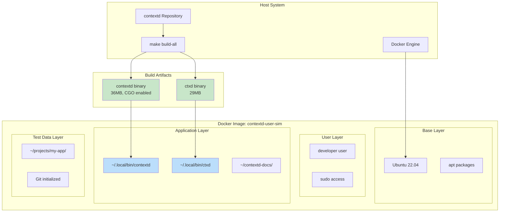
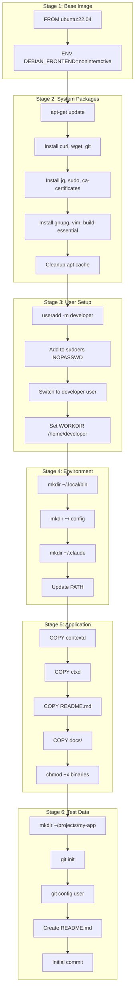
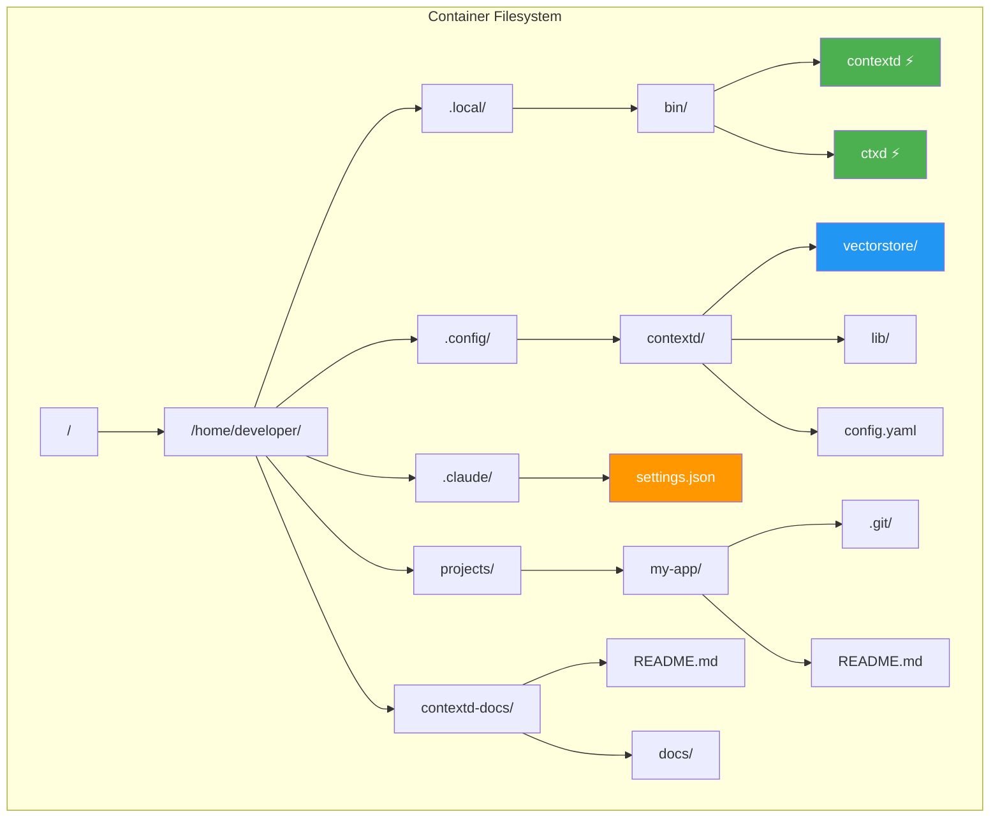
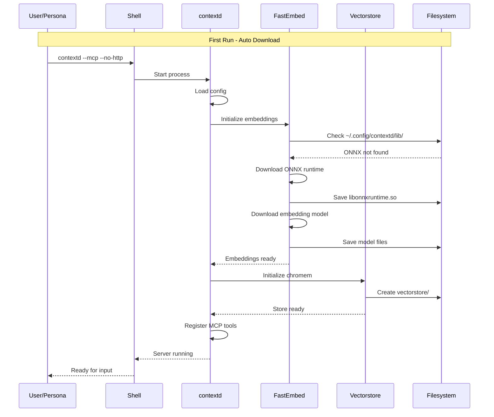
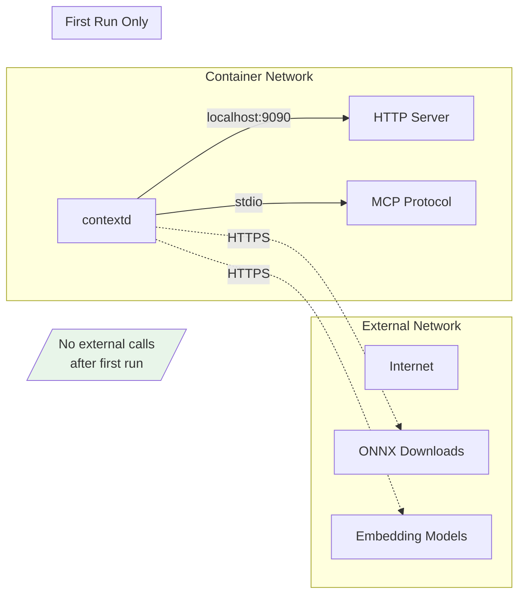
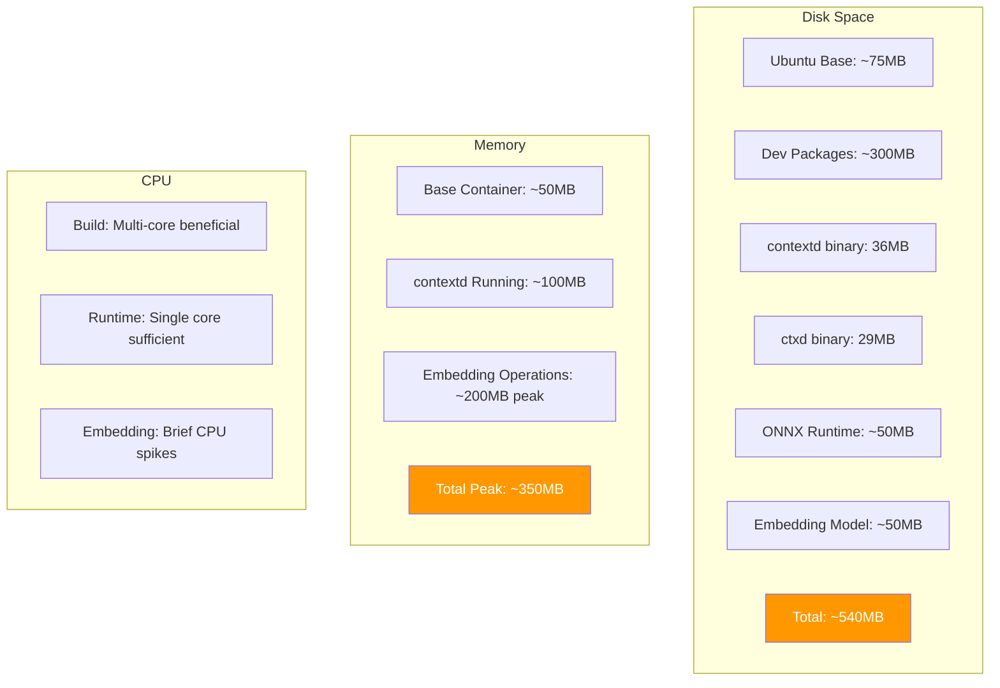
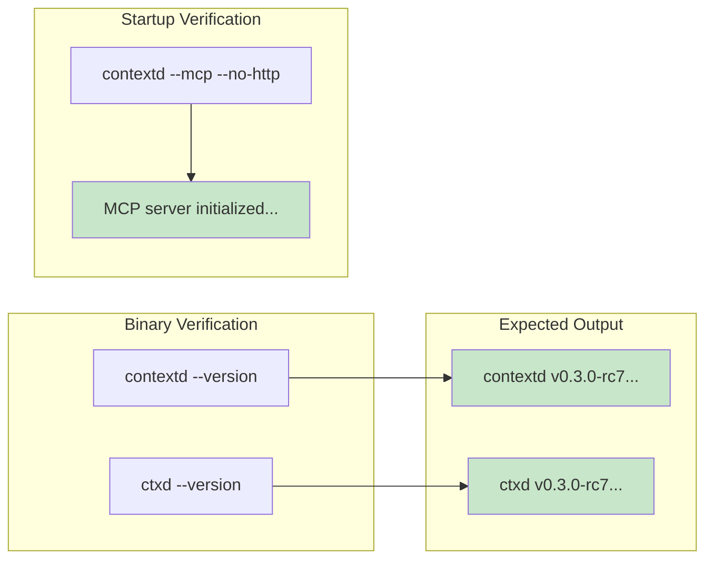

# Test Environment Architecture

This document details the test environment used for persona simulation.

---

## Container Architecture



---

## Dockerfile Breakdown



---

## Directory Structure



---

## Runtime Data Flow



---

## Network Isolation



---

## Resource Requirements



---

## Build Commands

```bash
# From repository root
cd /home/dahendel/contextd

# Build binaries
make build-all

# Copy to test directory
cp contextd ctxd test/persona-simulation/
cp README.md test/persona-simulation/
cp -r docs test/persona-simulation/

# Build Docker image
cd test/persona-simulation
docker build -t contextd-user-sim -f Dockerfile.user-sim .

# Run container interactively
docker run -it --rm contextd-user-sim

# Run specific test
docker run --rm contextd-user-sim contextd --version

# Run with environment override
docker run --rm -e VECTORSTORE_PROVIDER=invalid contextd-user-sim contextd --mcp --no-http
```

---

## Verification Commands


